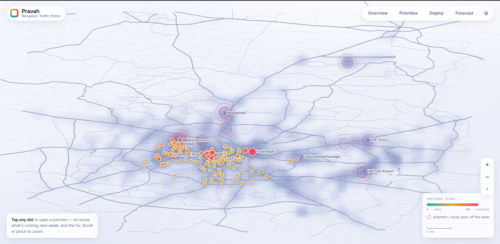
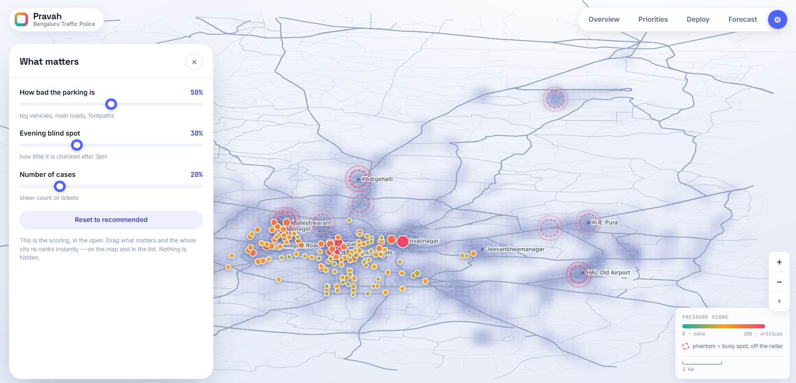
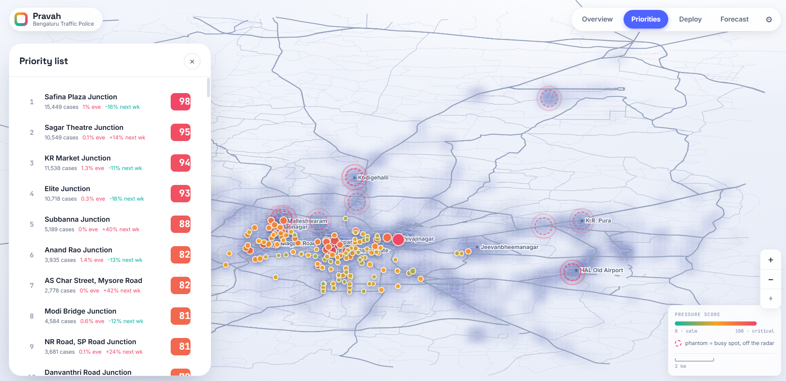
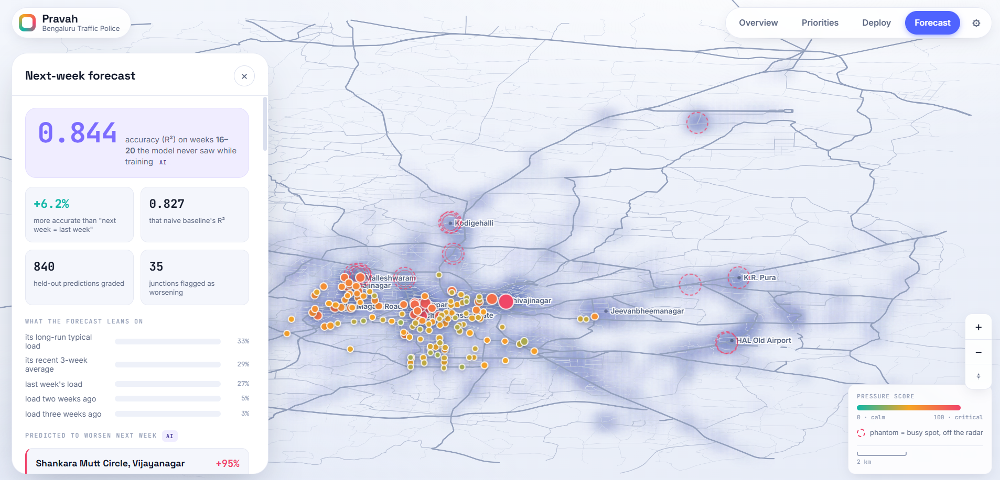
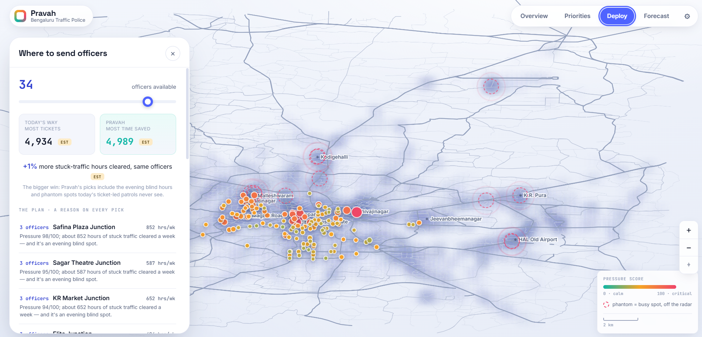
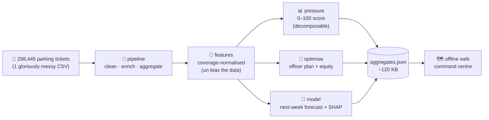
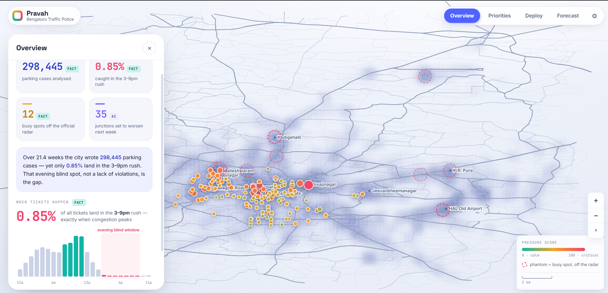

<div align="center">

# 🚦 Pravah · प्रवाह

### *Stop counting tickets. Start recovering time.*

**A glass-box command centre that tells the Bengaluru Traffic Police where to send officers — measured in the only currency that matters: your time stuck in traffic.**


**[▶ Open the live demo](https://anpixelartist.github.io/pravah/)** · built for **Flipkart GRiD · Round 2** · Problem Statement 1 — Parking-Induced Congestion



</div>

---

## 🐢 Once upon a traffic jam…

Bengaluru is a wonderful city where the auto says *"no"*, the rain says *"surprise"*, and a 5 km trip says *"pack snacks."*

So we asked the obvious question: **where should police actually stand to fix this?**

We pulled out **298,445 real parking-violation records** expecting answers. Instead we found a plot twist:

> 🕳️ **Only 0.85% of all tickets are written in the 3–9 PM rush** — exactly when the city turns into one giant parking lot.

The data wasn't telling us where the problem *is*. It was telling us where the **officers were standing**. Tickets only exist where someone was watching — so "no tickets after 3 PM" doesn't mean "no chaos after 3 PM." It means **nobody looked.**

We call this **the blind spot.** Pravah is the thing that turns the lights back on. 💡

---

## 🎯 So what does Pravah actually do?

It takes a messy spreadsheet of violations and turns it into a **decision tool a constable can act on in 10 seconds** — no PhD, no jargon, no "trust me bro" black box.

### 1. A real map of the city, not floating dots 🗺️
Every junction is a dot, coloured by a single **pressure score (0–100)** — like an air-quality index, but for congestion. Zoom, pan, tap. It runs **fully offline** (because conference Wi-Fi is a known villain).

### 2. Every score is glass — and *you* hold the dials 🔍
No mystery numbers. Tap any junction and its score breaks into plain parts — *how bad the parking is · the evening blind spot · sheer volume* — plus the **actual tickets** behind it. Don't agree with how we weighed it? Drag the sliders and **the whole city re-ranks live**, right in front of you. Defendable to a senior officer *and* an RTI request.

<p align="center"></p>

### 3. A priority queue: worst first, no guessing 📋
The whole city, ranked. Safina Plaza, KR Market, Sagar Theatre… each with its pressure score and an "is-this-getting-worse?" tag. Tap a row to fly to it on the map.

<p align="center"></p>

### 4. It sees next week before next week does 🔮
An **interpretable** ML model predicts which junctions are about to get worse — and lights them up in coral on the map. **84% accurate (R²) on weeks it had never seen.** Gradient-boosted trees + SHAP, so it *explains every guess*. (No neural nets. None. We checked.)

<p align="center"></p>

### 5. It writes the deployment plan — with a reason on every pick 👮
Set your real officer count, and Pravah places them to clear the most stuck-traffic hours, with a one-line *why* and an **equity check** so no neighbourhood gets ignored.

<p align="center"></p>

> ### 🤥 The honesty box
> We could've claimed our optimiser is 10× better. It isn't — ticket-count and impact correlate 0.98, so re-ranking alone adds a humble **~3–5%**. We *say so*, right in the UI. The real superpower is structural: Pravah covers the **evening blind hours and phantom hotspots** that ticket-led patrols literally never see. Honesty is a feature, not a bug. 🫡

---

## ⚙️ The entire process (a.k.a. how the sausage is made)



1. **Read the chaos.** One ~110 MB CSV of anonymised violations goes in. (It never leaves your machine — see governance.)
2. **Clean + enrich.** Filter to Bengaluru, convert to IST, turn each violation into *hours of stuck traffic* (severity × vehicle footprint — a lorry ≠ a scooter).
3. **Un-bias it.** Coverage-normalised features so the model stops saying *"patrol where you already patrol."*
4. **Score, optimise, forecast.** Three pure, testable, explainable modules.
5. **Bake a tiny JSON** (~120 KB) so the browser never touches 298k rows.
6. **Render an offline command centre** on a real Bengaluru street map. Double-click `web/index.html`. That's the whole magic trick. 🎩

---

## 🧩 How Pravah answers the problem (PS1)

| The brief asks for… | Pravah serves |
|---|---|
| Enforcement is **reactive** | a **forward forecast** of next-week pressure (AI) |
| No **impact heat-map** | a live **pressure map** of 137 junctions |
| Hard to **prioritise** | a ranked list + **phantom hotspots** off the radar |
| **Quantify** parking's impact | violations → **hours of stuck traffic** |
| Enable **targeted enforcement** | an **explained deployment plan** |

---

## 📟 The dashboard, in one glance

<p align="center"></p>

Every single number wears a badge so you always know what you're looking at:
**`FACT`** (measured from data) · **`EST`** (modelled) · **`AI`** (the model's prediction). No vibes. Only receipts. 🧾

---

## 🏃 Run it yourself (it's almost rude how easy this is)

**Option A — just look at it (zero setup):**
```bash
# open the live demo
https://anpixelartist.github.io/pravah/
# …or unzip the source and double-click web/index.html — it runs offline. No server. No internet. No excuses.
```

**Option B — rebuild everything from the raw data:**
```bash
make setup                 # install deps (uv or pip)
# drop the parking CSV into data/raw/  (see data/raw/README.md)
make aggregates            # rebuilds the data; prints the FACT + MODEL check
make test                  # 32 unit tests
python scripts/e2e_check.py  # 27 data-integrity checks
open web/index.html
```

---

## 🔢 Numbers we're quietly proud of

- **298,445** violations analysed across **21.4 weeks**
- **0.85%** caught in the 3–9 PM rush — the blind spot `FACT`
- **12** phantom hotspots · **~3,489** repeat-offender vehicles `FACT`
- Forecast **R² 0.844** on held-out weeks (beats "next week = last week") `AI`
- **97** automated checks, **0** failing 🟢

---

## 🛠️ Under the hood

- **Engine:** pure Python — `pipeline → features → pressure / optimise / model`, wrapped by `explain / validate / equity`. Pure functions in, data out, fully unit-tested.
- **ML:** scikit-learn gradient boosting + SHAP. Interpretable on purpose.
- **Frontend:** vanilla HTML/CSS/JS. No framework, no build step, no 400 MB of `node_modules`. Self-hosted fonts + a bundled OpenStreetMap basemap so it's genuinely offline.
- **Privacy:** vehicle numbers are personal data — used only for the repeat-offender count, never shipped to the browser.

---

## 👥 Team — the four humans behind the flow

> Built with chai, questionable sleep schedules, and an unreasonable hatred of traffic.

- **Aditi** 🎙️ — *the voice.* Turns cold numbers into a story humans actually feel.
- **Pritipratyush** 🧠 — *the engine room.* Built the brains: the pressure index and the AI. (Yes, he will explain SHAP at parties.)
- **Nixita** 🔬 — *the truth-teller.* Owns the problem and the data, and keeps everyone honest.
- **Rashmi Ranjan** 🎬 — *the showrunner.* Drives the demo and supplies 90% of the team's energy.

---

<div align="center">

### Pravah recommends — an officer decides. Always a human in the loop. 🤝

**Stop counting tickets. Start recovering time.**

<sub>Made for Bengaluru, with love and mild road rage. 🚦</sub>

</div>
